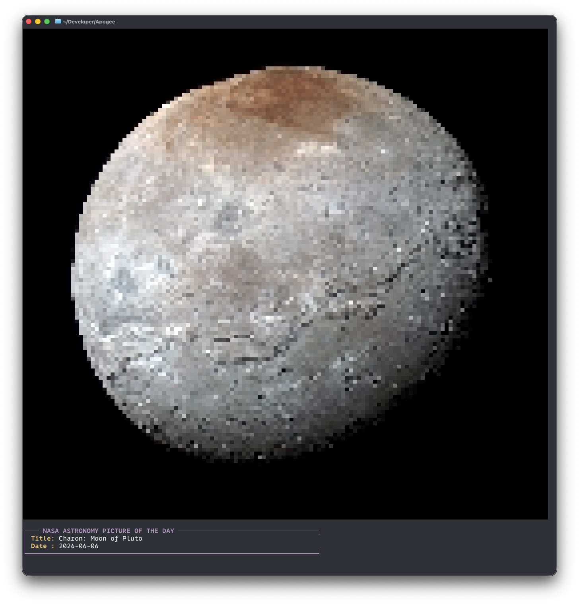

# Apogee

**A pure C CLI tool to fetch and display the NASA Astronomy Picture of the Day.**

Apogee is a designed to be lightweight and fast.

It fetches the daily JSON payload from NASA's API, download the target image, decode it entirely in memory, and translate the pixels into true-color ANSI half-blocks.


## 🖼️ Image



## ⭐ Features

* **Terminal-native rendering:** Uses 24-bit RGB ANSI escape codes and `▀` (half-block) characters for high-resolution terminal output
* **Dynamic scaling:** Automatically detects your terminal window size via `ioctl` and scales the image to fit perfectly without breaking your scrollback
* **Minimal dependencies:** Written in pure C using `libcurl` for network requests, `cJSON` for parsing, and the `stb_image` header for decoding
* **API safety:** Includes robust error handling (and explicit parsing for NASA's `OVER_RATE_LIMIT` throttle restrictions)

## 🛠️ Prerequisites

You only need a standard C build environement and libcurl installed.

* `gcc` or `clang`
* `make`
* `libcurl` development headers (e.g., `sudo apt install libcurl4-openssl-dev` on Debian based distro, `sudo pacman -S curl` on Arch based distro or `brew install curl`)

## 💾 Installation & build

Clone the repository and compile using the included Makefile:

```bash
git clone https://github.com/wirenux/apogee.git
cd apogee
make
```

## 🕹️ Usage

You will need a free API key from [NASA's API Portal](https://api.nasa.gov).

Once you have it you can run to tool by passing the key as an environment variable.

### Standard run:

```bash
export NASA_API_KEY="your_nasa_key"
make run
```

*Or directly via the binary:*

```bash
NASA_API_KEY="your_nasa_api_key" ./build/apogee
```

### Demo mode:

If you just want to test the tool without an API key, you can bypass authentication using the shared NASA demo key.

*(Note: The demo key is heavily rate-limited globally, so if it don't work just try with your own API key ;-) )*

```bash
make run ARGS="--demo"
```

*Or directly via the binary:*

```bash
./build/apogee --demo
```

## 📃 License

[MIT LICENSE](./LICENSE)